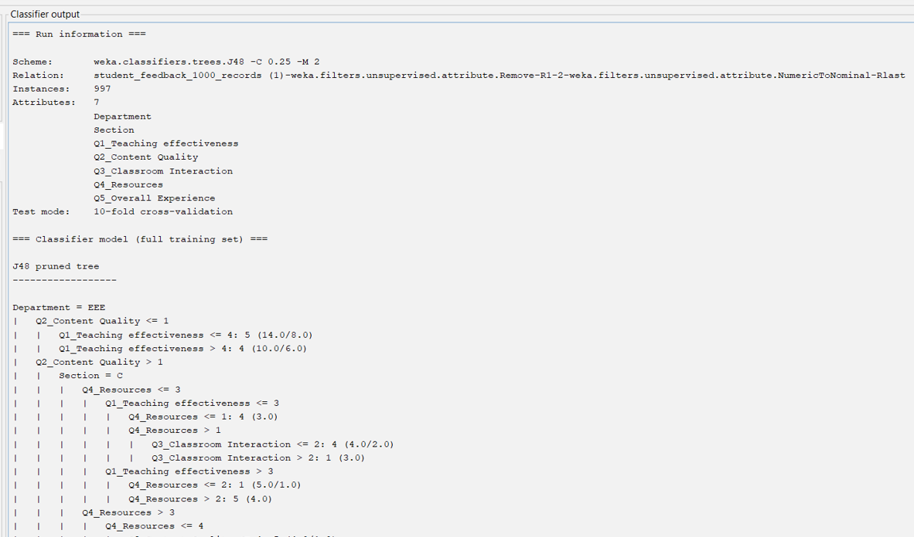
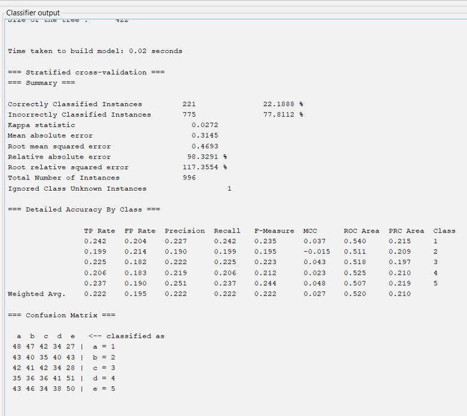
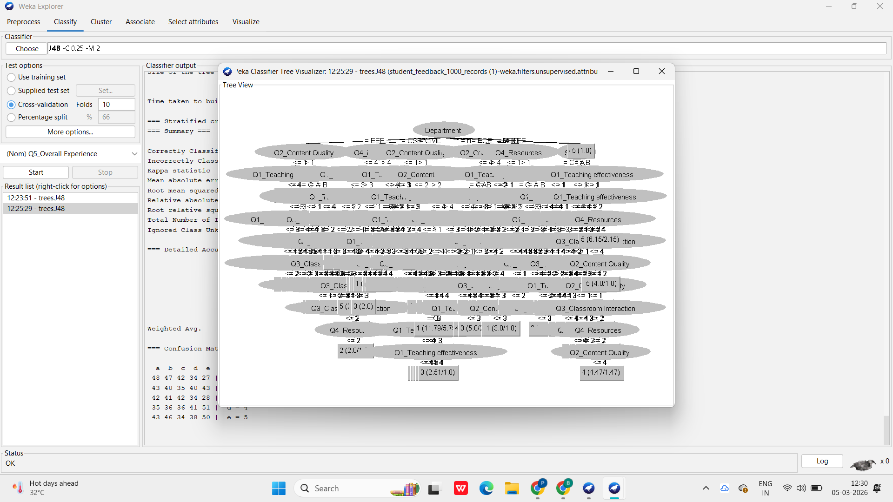
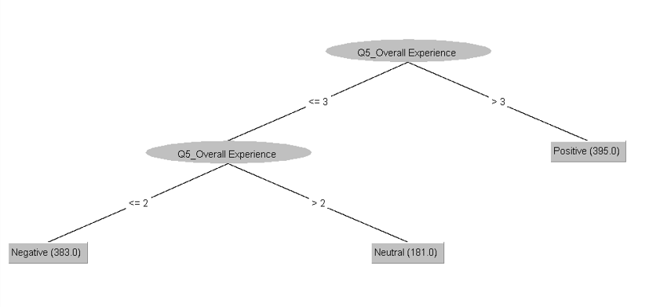

# 📊 Educational Quality Analysis Through Student Feedback

A data mining project that analyzes student feedback to evaluate educational quality and identify the key factors influencing students' overall learning experience.

---

## 📌 Project Overview

This project applies data mining techniques to student feedback datasets to discover meaningful patterns and insights that can help improve educational quality.

The analysis includes data preprocessing, dataset cleaning, classification using the WEKA J48 Decision Tree algorithm, visualization, and extracting valuable insights from student responses.

---

## ✨ Features

* Student feedback analysis
* Data preprocessing and cleaning
* Educational quality evaluation
* Decision Tree (J48) Classification
* Dataset visualization and analysis
* Python-based implementation
* WEKA-based machine learning experiments

---

## 📂 Project Structure

```text
educational-quality-analysis/
│
├── Datasets/
│   ├── data_mining.py
│   ├── Pre_processed_data.csv
│   ├── student_feedback_1000_records.csv
│   ├── student_feedback_1000_records.arff
│   ├── student_feedback_advanced_600_records.csv
│   └── student_feedback_advanced_600_records.arff
│
├── Reports/
│   └── Educational_Quality_Analysis_Report.pdf
│
├── PPT's/
│   └── Educational_Quality_Analysis_Presentation.pptx
│
├── screenshots/
│   ├── classifier-output.png
│   ├── classification-summary.png
│   ├── decision-tree.png
│   └── simplified-decision-tree.png
│
└── README.md
```

---

## 🛠 Technologies Used

* Python
* WEKA
* Data Mining
* Decision Tree (J48)
* CSV
* ARFF
* Educational Data Analysis

---

## 📸 Screenshots

### 📊 Classifier Output



---

### 📈 Classification Summary



---

### 🌳 Decision Tree



---

### 🌿 Simplified Decision Tree



---

## 📈 Project Outcome

This project analyzes student feedback data to identify trends and insights that support better educational decision-making and improve overall learning quality.

Using the WEKA J48 Decision Tree algorithm, the project classifies student feedback and highlights the factors that have the greatest influence on students' overall educational experience.

---

## 🚀 Future Improvements

* Apply additional machine learning algorithms for comparison.
* Develop interactive dashboards for feedback visualization.
* Automate data preprocessing workflows.
* Improve classification accuracy using feature engineering and hyperparameter tuning.

---

## 👨‍💻 Author

**Pavani Biruda**

AIML Undergraduate | Python Developer | Machine Learning Enthusiast

GitHub: https://github.com/pavanibiruda
